# 杭州电子科技大学超算使用指南

## 基础知识

### 软件简明教程

这里只讲软件使用的必要步骤，详细使用及安装请移步[linux 学习笔记（链接施工中……）](https://github.com/LCQaha/My_notebook/blob/main/Linux/HanSP_notebook.md#%E8%BD%AF%E4%BB%B6%E6%96%BD%E5%B7%A5%E4%B8%AD)，如果觉得本节太难请直接跳过。

在本节中，将介绍如何使用 XShell 和 Xftp。根据当前信息，这两个软件只能在杭州电子科技大学校园网中使用，若使用时您在校外，请使用 VPN 登陆后直接在网页操作。

#### XShell

本软件用于取代网页端的命令行操作。

1. 点击`命令行[E-Shell]`
   
2. 下载密钥文件
   记住这里的 ip 和端口号，后面需要用到。
   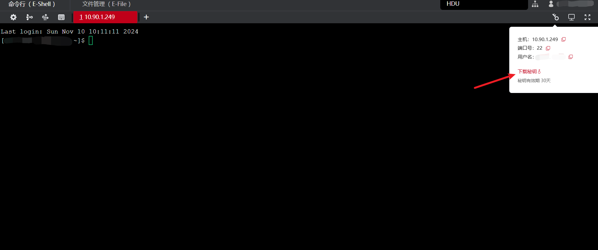
3. 修改名称
   将下载的文件`*_rsa.txt`修改为`*_rsa`，这是用于访问超算服务器的私钥。
4. 打开 XShell，完成基本设置
   - 点击`文件-新建`
     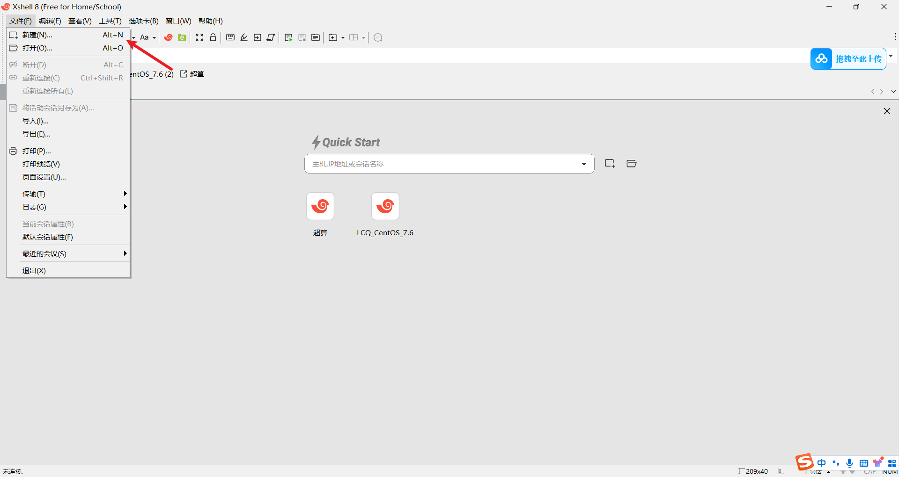
   - 在`链接`选项下作如下设置，请对照和下载时的 ip 和端口号是否一致：
     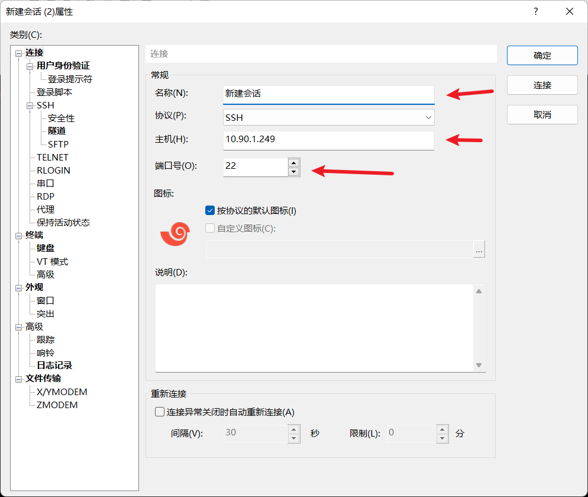
   - 在`用户身份验证`选项下修改登录方式为`Public Key`，并输入用户名（确保与你的超算账号用户名一致）
     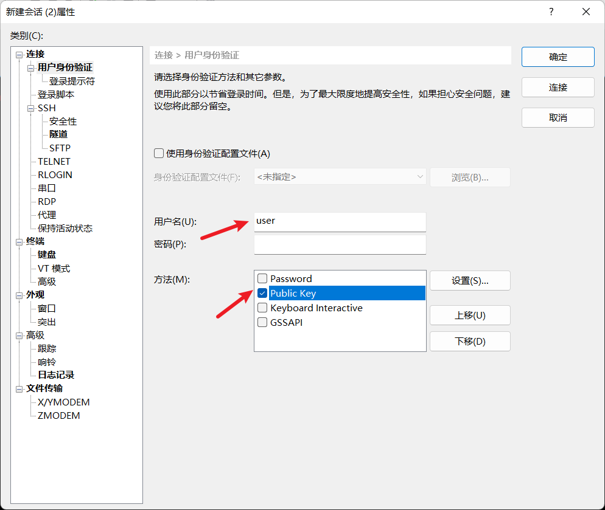
   - 选中`Public Key`，点击设置
     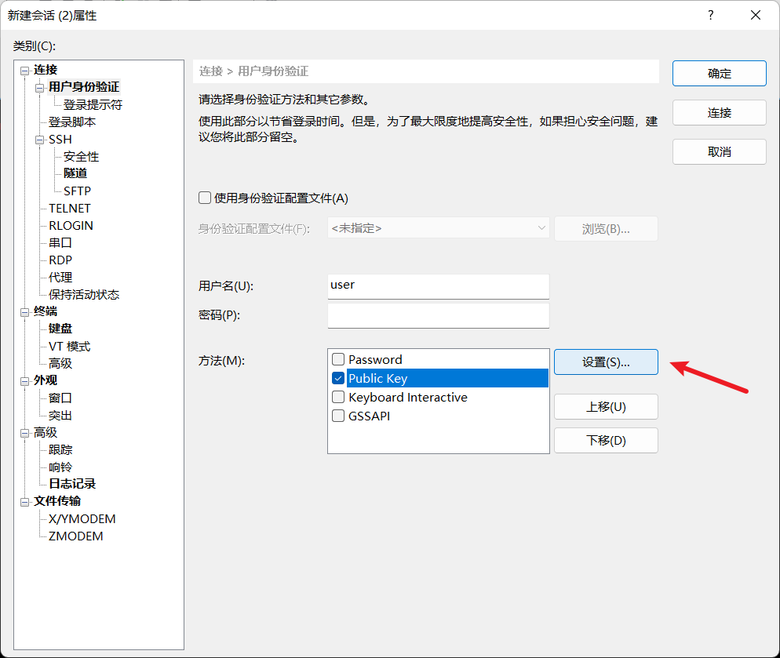
   - 在设置中选择选择密钥文件，点旁边的三个点。
     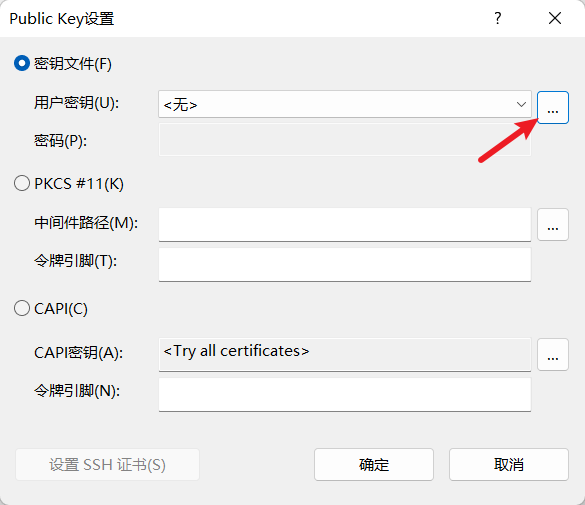
   - 点击导入，找到你刚才保存的密钥文件，点击确定。
     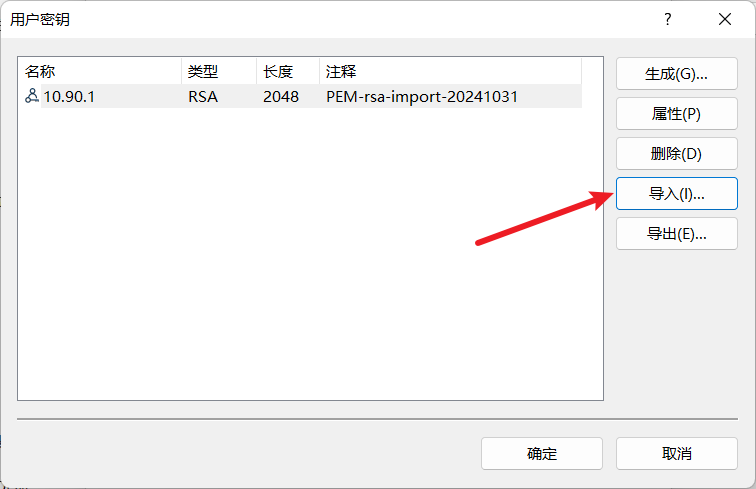
   - 点击图中按钮，将链接添加至链接栏。
     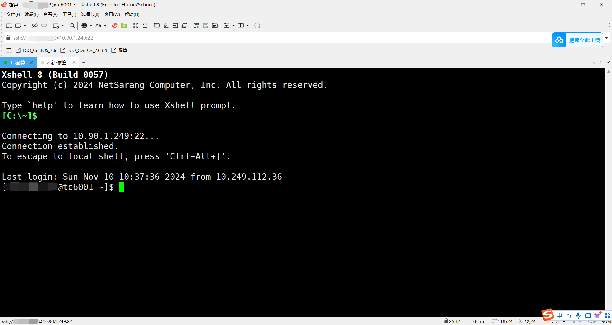
   - 点击链接，开始访问。
5. 基本命令教学
   - `ls`：列出当前目录下的所有文件。
   - `

#### Xftp

本软件用于与远端服务器（这里是超算）进行文件传输。

1. 从 XShell
2. 打开 Xftp，完成基本设置
   - 点击`文件-新建`
     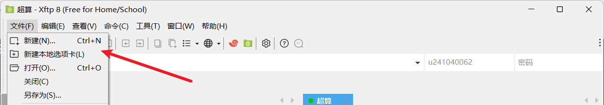
   - 按照下图所示进行设置：（ip 和端口号、用户名、Public Key，与 XShell 一致）
     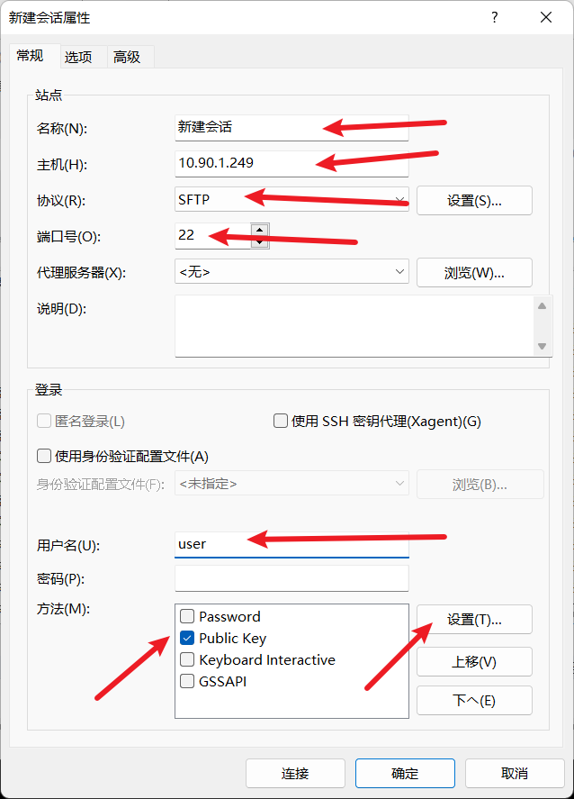
3. 向远端服务器发送文件
   - 登录成功后，窗口会分成两个区域，左侧为你的本地目录，右侧为远端服务器目录。
   -

### 网页端使用

点击下面的网址输入账号密码后登陆：
[https://manage-sc.hdu.edu.cn/sso/login](https://manage-sc.hdu.edu.cn/sso/login)

若您处于校外，请使用 VPN 进行登录，然后在 VPN 中选择“超算平台”并输入账号。

1. [杭州电子科技大学 VPN](https://vpn.hdu.edu.cn)

####

#### E-Shell 命令行

### slurm 脚本编写

```bash
#!/bin/bash
#SBATCH -J <job_name>
#SBATCH -p <process_name>
#SBATCH -N <node_number>
#SBATCH --ntasks-per-node=<core_number>
#SBATCH --gres=gpu:<gpu_number>
#SBATCH --time=<time_limit>

cd $SLURM_SUBMIT_DIR
#################################
source /public/software/profile.d/***.**

srun hostname -s | sort -n >slurm.hosts
OMP_NUM_THREADS = $SLURM_NPROCS

```

## MATLAB

### 上传代码文件

为了保证作业的规范性，在上传代码文件时请遵循以下规则：

1. 在用户主目录下创建一个名为`code`的文件夹，所有代码均保存在这里。
2. 如果一个账号有多人同时使用，建议在`code`下建立一个以名字命名的文件夹（不得使用空格、中文及其他特殊符号）。
3. 文件上传到自己的代码文件夹中。
4.

### 作业提交

1. 将光标置于上方第一个选项的位置（这里是“工程计算”）然后选择`仿真计算`
   
2. 将光标置于 Matlab 上，可以选择模板、命令行、图形三种模式（若没此选项请联系管理员）
   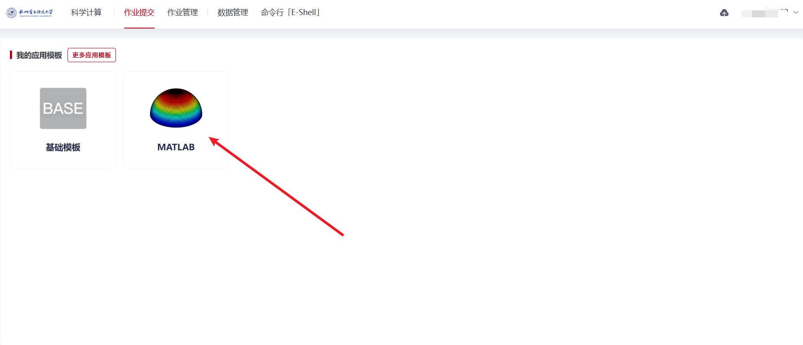
   
3. 如果代码中不含有`parpool`等调用并行计算的代码，则只需申请一个核心就可以了。

#### 图形化界面

下图是图形化界面配置选择界面，在这里选择本次开启使用的版本、核心数和最大运行时间。（建议 4 个或更多）

系统中自带的 Matlab 版本及其位置：

- 2021b：`/public/software/apps/MatlabR21b/bin/matlab`
- 2020a：`/public/software/apps/MatlabR20a/R2020a/bin/matlab`

**注意**：
**1. 模板中的预置版本不能使用，请自己手动配置可用路径，若需其他版本，请联系管理员。**
**2. 图形化界面使用完后，务必手动关闭，否则会持续计费至截止时间，并占据超算资源，请避免资源浪费。**
**3. 最大运行时限到达后会强制结束进程，请至少设置 72 小时，避免计算任务无法完成。**

#### 模板

下图是模板配置界面，在这里选择需要使用的代码文件，以及版本、所需的计算资源。

#### slurm 脚本

### 代码规范

1. 文件路径
   由于 Windows 和 Linux 系统文件路径格式不同，故建议通过代码代替路径字符串建立文件的保存路径。

   ```matlab
   %% 代码说明：
   % 本示例代码表示了一个简单的文件/文件夹创建方法。
   % 示例方法只能建立一层文件结构，本示例中创建的是".\my_foldername\"，若要建立多层，则需在fullfile()中添加更多的字符串。
   % 如创建".\subfolder\my_foldername\"，则使用：
   % fullfile(pwd,'subfolder',my_foldername)

   %% 代码示例：

   % 获取当前工作目录（绝对路径）
   current_dir = pwd;

   % 设置文件夹名称
   folder_name = 'my_foldername';

   % 拼接路径
   folder_path = fullfile(current_dir,folder_name);

   % 创建文件夹
   if ~exist(folder_path, 'dir')
      mkdir(folder_path);
      disp(['文件夹 ', folder_name, ' 创建成功']);
   else
      disp(['文件夹 ', folder_name, ' 已经存在']);
   end

   ```

### MatLab

本节只列出作业提交脚本编写范例，具体代码编写技巧请参照：[MATLAB 代码编写规范](./MATLAB_code_guide.md)

1. 单核心

   ```sh
   #!/bin/bash
   #SBATCH -J <job_name>
   #SBATCH -p normal
   #SBATCH -N 1
   #SBATCH --ntasks-per-node=<core_number>
   #SBATCH --time <time_limit>

   cd $SLURM_SUBMIT_DIR
   source /public/software/profile.d/apps_matlab2020a.sh

   matlab -nodesktop -nosplash -nodisplay -r <matlab_script>
   ```

   1. `#!/bin/bash`：shebang 行，用于指定脚本解释器
   2. `#SBATCH -J <job_name>`：指定任务名称为`<job_name>`
   3. `#SBATCH -p normal`：指定队列，一般采用默认值`normal`
   4. `#SBATCH -N 1`：指定节点数，一般为 1。
   5. `#SBATCH --ntasks-per-node=<core_number>`：指定每个节点的 CPU 核心数为`<core_number>`
   6. `#SBATCH --time <time_limit>`：指定任务运行时限，如 1 小时，`1:00:00`。
   7. `cd $SLURM_SUBMIT_DIR`：切换到任务提交目录。
   8. `source /public/software/profile.d/apps_matlab2020a.sh`：指定 Matlab 环境，当前可选环境为：
      - `/public/software/profile.d/apps_matlab2020a.sh`
      - `source /public/software/profile.d/apps_matlab2021b.sh`
   9. `matlab -nodesktop -nosplash -nodisplay -r <matlab_script>`：执行脚本，不显示桌面环境、不显示启动画面、不显示图形画面。其中`<script_name>`为脚本名称，如`test`（不带`.m`）。

2. 多核心

## Pytorch
